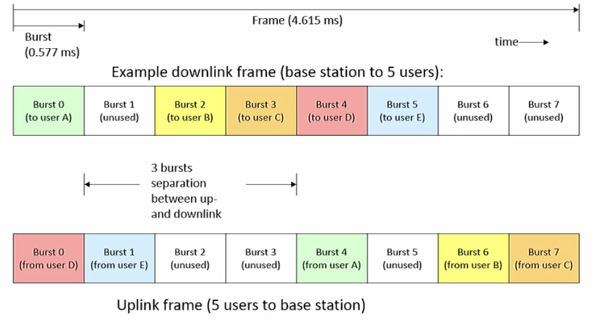
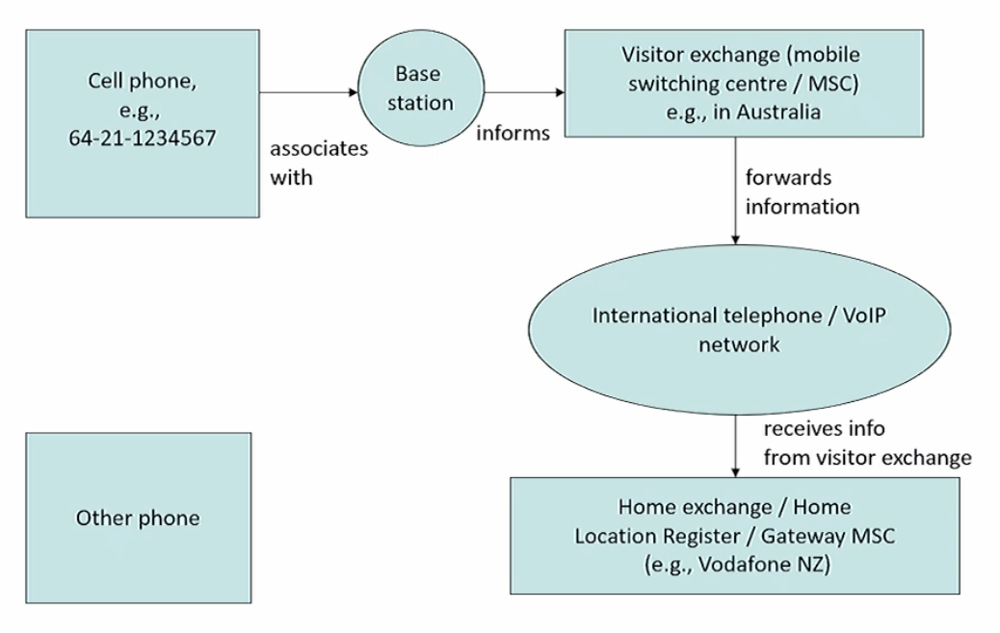
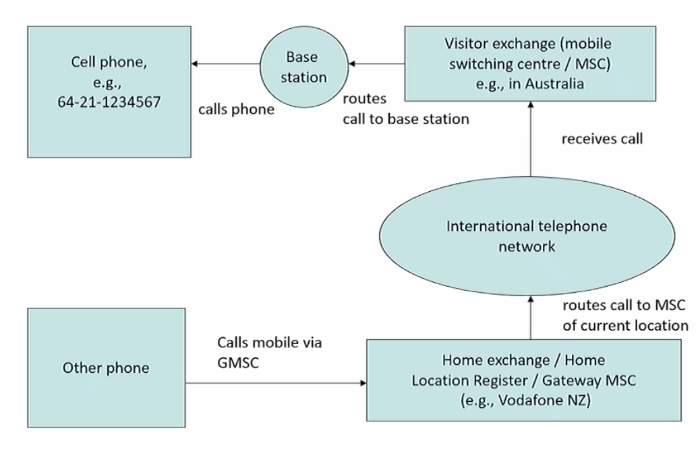

(Sept 27th)

Advantage of covering this "legacy" technique; basically introduces us to a broad range of techniques that are used all the way up to 5GHz, but respectively are in a more primitive form, hence easier to understand.

# Mobile network case study: GSM (2G)
What happens on-air?
- Two 25MHz bands - one for uplink (890-915MHz, mobile to base), one for downlink (935-960MHz, base to mobile).
- What does the uplink and downlink frequency separation of 45MHz have to do with the weight of your handset? As we are trying to protect our receiver from our transmitter signals one of things that we can do is we can put a filter on front of our receiver and a filter in front of our transmitter. In case of a transmitter, filter allows our transmitter transmit on intended frequency and suppresses unintended and vice versa re: receiver. Filters are lighter weight when the separation between frequencies is bigger. So effectively, 45MHz ~ implies lighter weight phones. Don't receive and transmit simultaneously, but neighbouring phones/interference exists (cavity filters, cylinder, need 4-6 of them, to get the amount of filtering needed). Base station can have a lot of them allowing them to simulatenously transmit and receive.
- Frequency Division Multiple Access (`FDMA`): 25MHz band is divided into 124 frequency sub-bands of 200kHz each (plus one guard band)
- Time Division Multiple Access (`TDMA`): on each 200kHz sub-band, there are 8 time slots (bursts). Each burst lasts about 0.577ms and has a length of 156.25bits. A full frame of 8 bursts last then 4.615ms. Idea is to transmit on one, listen on the other - separating the two by some buffer to allow for clear cut separation between transmission and receiving (4 bursts).

- Each burst is allocated to a single user A "channel" in GSM is defined by its frequency and the burst offset in the frame.
- Uplink and downlink channels are separated by 3 other bursts - a mobile never has to transmit and receive simultaneously.
- Theoretical channel bandwidth is just under 34kbps, but overheads are significant! Only 60 bits in each burst carry actual data - the rest is system overhead.
- Frequency hopping may be used to combat multipath and co-channel problems.

## Why burst separation in GSM
- If a transmitter is active, it still produces a small signal on nearby frequencies (nearby = same order of magnitude frequencies). This is unwanted. Why?
- If we have a receiver operating near the transmitter (new = within a few metres away) on a nearby frequency, then this small signal gets into the receiver's input, where it interferes with the (possibly weaker) signal that the receiver is supposed to receiver.
- Similarly, every receiver is susceptible to very strong signals that are close in frequency to its intended receive frequency.
- _Take cheap radio broadcast receiver close to a powerful transmitter (e.g., Henderson transmitter site close to the NW motorway)_.
- Receivers adjust themselves to the signal level that they receive - cannot cope well with receiving a weak signal immediately after a strong one has gone away.
- Can deal with these problems by attaching sharp filters to receiver and transmitter - but they are expensive and large (a filter set for a mobile phone would be about the size of a sixpack of beer cans)
- A cellphone is a receiver bundled with a transmitter on a nearby frequency and in a very small space - filters are too large and too expensive for a handset. Must make sure it doesn't transmit while it is trying to receive something. Hence burst separation.
- Base stations are large and filters are a shared cost here. Hence simulate nous transmit/receive is possible.

## Range?
- Burst transmissions can only be delayed by up to 8 bits. That is ~9km round-trip distance...
- If the distance is larger, the return burst from the mobile interferes with the subsequent burst
- Distance can be extended by leaving subsequent burst unused.
- 4G and 5G can go up to 150km in a macrocells in bands < 6GHz (5G mm wave frequencies have much shorter ranges of a few 100 only)

## Cell siting (site) - in young networks
Scenario being you start a cell company

- Early phase of network development - few users, few sites, little pressure on frequency resource, large cells.
- Cell base stations are mainly sited on hilltops, large buildings in order to maximise coverage per cell.

## Cell siting - in mature networks
- Mature phase of network development - many users, many sites, lots of pressure on frequency resource, small cells
- Cell base stations are mostly situated at ground level at the bottom of valleys - use hills or buildings as shields to limit coverage/number of users in cell and enable frequency **re-use** on other side of hill.
- "Umbrella cells"/macro cells on hilltops and other high sites can provide coverage for areas not covered by other cells - can use signal level measurements to help in assignment of base station to mobile.

# Fast-Moving Mobile Devices
- Why shouldn't you use your mobile phone on a plane?
- If a mobile moves quickly with respect to the base station, a number of problems can occur.
- Doppler effect can cause rapid multipath fading and also changes in received physical bit rate.
- Frequent _handovers_ between multiple base stations put a high load on the system.
- GSM was designed to permit mobiles to move at up to 250-300km/h. This is too slow even for some high-speed trains (e.g., TGV in France, ICE in Germany)
- 3G and higher permits vehicle velocities up to 500km/h (high-speed train). Handover management there is much more complicated!
- If a mobile is in a high location (plane) with a number of cells within reach, a large number of cells may get jammed. This is in particular a problem where it prevents frequency re-use.
    - Some airlines now have cells on board that link back via satellite, so you can use your phone (at a huge price).
    - Note: Some 5G frequencies DO cause problems if used on the ground near airports.

"Interference with navigational aids" is more or less a red herring - if your airline didn't enforce a ban on mobiles, the network operators would probably stomp on them.

# GSM Multi-frames and Channel Types
- 26GSM frames are joined together to a multiframe
- 2 x 12 of these frames carry traffic channels (TCH), one or more of which may be replaced by fast associated control channel (FACCH) frames.
- 1 frame is the slow associated control channel (SACCH), which is used for the same information as the FACCH, if it's less urgent
- 1 frame is unused - this is when everyone shuts up so the mobiles can listen to other base stations to see whether there is a stronger one around
- Can also fit various other control and broadcast channels:
  - RACH (random access channel), idea mobile use it to request network access.
  - AGCH (access grant channel), used by the base station to tell the mobile that it has been accepted onto the network and which parameters to use.
  - PCH (paging channel), used to call a mobile when there is an incoming call.
  - Channels for synchronization and frequency reference.

# Tracking and Calling
Suppose you have a cellphone joining

Then another cellphone calling in

- Mobile network operator establishes virtual data circuit to its internet gateway, using mobile protocols.
- Mobile node and gateway establish link using PPP or similar protocols
- Mobile node negotiates IP configuration with the mobile provider via the PPP link
- IP configuration generally remains constant while node moves within the operator's network.
- Virtual circuit and PPP connection remain in place while node moves about.
- Move between base stations is only handled by mobile protocols below PPP

## Higher data rates and more users
- GSM was the first fully digital wide area mobile communication standard with a widespread implementation. Known as a/the "2G" system (succeeding analog)
- But: GSM data rates were very low (consider the effect that the SMS message size limit has had on human communication).
- Third gen and now 4th, 5th evolved in different designs
- We discuss some of the approaches/issues

### Technological Platform
- Conventional 2G technology and a large extent in 3G, the analog radio signals carrying the digital information are largely generated by analog components.
- But: all the analog components do is implement mathematical functions.
- In principle, these can be computed by software, too.
- Faster processors now mean that we can actually compute a lot these functions - so we get software-defined radio (SDR) or software radios for short.
- Advantage of an SDR is that it is easier to adapt to changes in standards and protocols - can do so on the fly.

### Spectrum for 3G and above
- Radio spectrum from which bandwidth can be taken is a limited resource
- Governments made some bandwidth available in blocks of spectrum that had been allocated but were never used, or that had been freed up by other services going away or moving to cellphones.
- In most cases, these were auction off to network operators for 3G use. This caused a gold rush - some governments made billions of dollars from the auctions.
- Challenge: how to make efficient use of the spectrum available. Spectrum within which some frequencies remain unused is not used efficiently.
