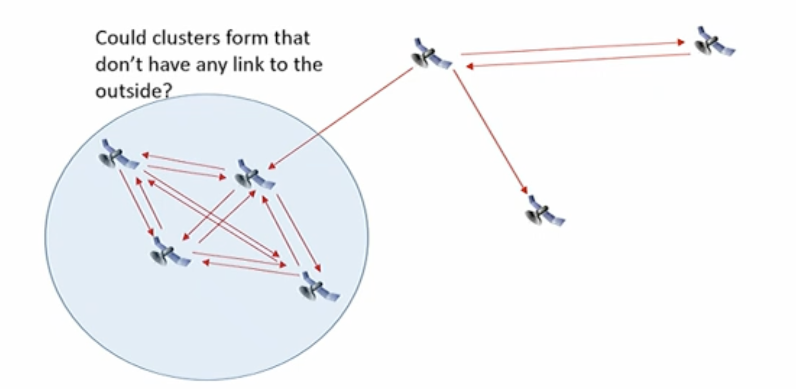

(5th Oct)

# Why the power budget in LEO's matters
LEO internet satellites tend to be smaller and lighter than GEO satellites.
- Typ. GEO: several tons, typ. MEO comms sat: a few 100kg.
- Less power needed for comms but also less weight allowance for batteries and solar panels.

Satellite only charges when it can see the sun
- GEO: 1 charge-discharge cycle per day, sees sun for ~22h 45min / day
- LEO: ~15 charge-discharge cycle per day, sees sun for ~12h / day

Battery life is measured in charge-discharge cycles.

_Third of intial satellites in starlink have already fallen (as opposed to 5-7yr lifespan of these, lifespan dictated by fuel requirements)_

We're now going to talk very specifically about Starlink (Ulrich has done a bit of work here for community hence the share)

# Starlink
Satellite internet division of SpaceX, completely rethought industry. Expensive rocket launch vs cheap rocket launch (re-usable). Expensive satellites vs cheap satellites.

- LEO
- In production operation since 2021
- Ku and Ka Band
- Constellation:
    - Time of lecture, ~3000 operational satellites, over 1000 rising or spares.
    - `https://satellitemap.space/`, `https://starlink.sx/`

# Direct to site as "Bent Pipe"
Up until Novemeber 2022.

#### Subscription model for large number of end users
- Large number of satellites

#### At Internet Gateway
- High gain antenna's (6 gateways in NZ)

#### At user end
- "Dishy McFlatface" antenna (not a dish, but a phased array)
- Able to track satellites electronically
- Mechanical tracking readjustment ability included

#### Entry cost
- NZ$650 (keeps changing, but at time of this lecture)
- Cost for running cable inside / roof install / roof mounts / wall breakthroughs

#### Subscription cost
- $160NZD (at time of this lecture) per month
- No data caps or rate limiting (for now)

# Direct to site with ISLs
- Laster inter-satellite links (ISLs) ("space lasers")
- Only on late 1st and 2nd generation Starlink satellites

## Dishy McFlatface
- First consumer-grade phased array antenna ever
- 58.4cm diameter in round version, 51.3 x 30.cm in stard rectangular version
- Two motors for mechanical positioning and maybe tracking
- Ethernet cable to WiFi router
- Able to track multiple satllites simulatenously
    - Standard version: communication via on satellite only
    - High performance version: communication via multiple satellites

# Teleports
Usually nine larger dish antennas in radomes. Over 150 (most in US, Asia Pacific, Europe, South America), few in equatorial regions.

# Satellites
#### Gen 1:
- 260 kg
- No lasers (most of them, anyway)
- Capacity per satellite: ~20Gb/s
- Orbital altitude: 550km

#### Generation 1.5 (from about mid-2022 onwards)
- Inter-satellite links with lasers!

#### Generation 2 (at time of current lectures is what is being launched)
- Specs not really known

# Starlink Challenges

#### Inclination: Most satellites are in 53 degree inclination orbits
- Good coverage between 40-something and 53 degree of latitude
- Less coverage over poles (coming with 97 inclination "polar" orbits)
- Satellite density lower over equatorial regions

#### Capacity:
- Current international average 24/7 internet usage per user: 1MB/s and **growing**
- If system capacity per satellite is 20Gb/s: 20,000 users per satellite
    - Doesn't account for peak time loads!
- Current number of satellites: ~3000 in service (Starlink want about 45,000)
    - Theoretically 3000 x 20,000 users = 60 million users. Currently: 2.1 million?
    - But: Many satellites see only few or no users (e.g., over ocean)
    - Number of unconnected / under connected users on Earth: ~3 billion

Geostationary arc protection, content delivery changes

Ground stations must not transmit to a LEO satellite if within 18 degree of the geostationary arc. LEO ground stations can interfere with GEO sats located "behind" target LEO sat.

### Gateway Placements
- Again good coverage between 40-something and 53 degree latitude
- Closest coverage over poles: 2 teleports in Alaska
- Nothing in equatorial

### Routing
- Space lasers are cool, but how does one route in a system like this?
- How many lasers does a satellite need? Say 3, pointing at the closest neighbours

#### How we thought Starlink would do it?
Continued in the next lecture...

### Business Model
- Direct to site means any CDN is by default on the other side of the satellite link
- 1000 cat video views...

