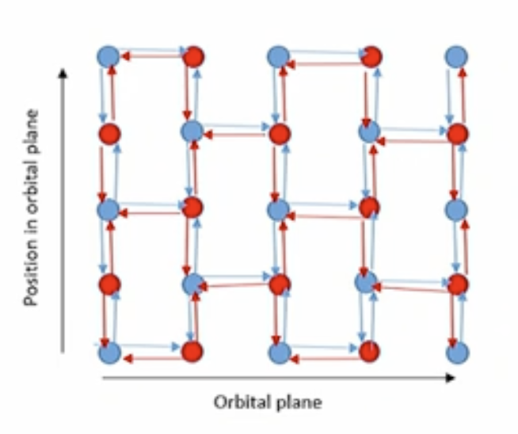

(6th Oct)

# How we thought Starlink would routing?
Within a constellation: 3 bi-directional ISL's per satellite. Colour-separated laser optical heads.
- One ISL goes to the next satellite flying _ahead_ in the same orbit.
- One ISL goes to the next satellite flying _behind_ in the same orbit.
- Satellites along the same orbit alternate between "red" and "blue":
    - 3rd ISL on "red" satellite goes to a "blue" satellite in the next orbital plane further west
    - 3rd ISL on "blue" satellite goes to a "red" satellite in the next orbital plane further east

"Blue" satellite transmits using shorter wavelength laser light than "red" satellite.

Challenges:
- East and west get reversed twice per orbital period
- What happens if a satellite fails?
- How does a satellite know which way a packet has to go?

## But No - Starlink `traceroute` from Tarawa
Traceroutes from Tarawa (Kiribati) shows all traffic emerging from Starlink's network in Auckland.
- Clearly no shortest-path routing in space.
- No in-plane optical path between Tarawa and NZ - Starlink's must be routing cross-plane!

_FCC; federal communications commission_

## Theoretical coverage of an ISP on a remote island
Typically CDN servers placed locally to tackle unnecessary traffic in the form of repeat demand. Key challenge of use of Starlink is the lack of CDN due to the direct-to-site setup. Cache on a satellite isn't as effective due to the LEO structure of the satellites. Hence satellites cannot take advantage of the common assumption of geographic "mutual interest" in content, thus cache won't theoretically be as well utilised. Next idea would be to place the CDN at the known "teleports/internet gateways", but the cache placement here is suboptimal to say the least due to the bottleneck (wrt. latency) sits in the "satellite portion" of the route.

Now entering a new topic altogether...
# Submarine Cable System
Underwater cabling system that hosts most intercontinental traffic we see today. Bulk international bandwidth capacity - orders of magnitude more than all satellite systems combined. Repeatered / unrepeatered. Aspects: construction and repair operations, topology: the role of geology and politics.
