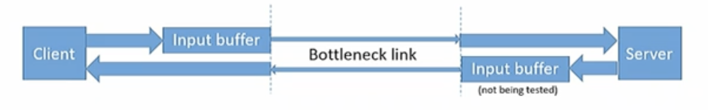

(13th Oct)

# Network-Based Congestion Control
Happens
- On the sending host, when the operating system kernel sends more data to an interface than the interface can push onto the medium.
    - Used to be a problem on hub-based Ethernets, today it's mostly an issue on WiFi
    - But: sending hosts have plenty of buffer memory & sockets can block or applications can resubmit data for sending - normally, nothing is losty (OK, CPU cycles)
- In the network, when switches or routers receiver more incoming packets for an output port than the output port can send
    - Primary reliance on sending TCP host (or UDP-based application) to detect and back off.

Rely on TCP sender to reduce pressure via ACK/lack of ACK feedbacks.

### Quick TCP congestion control recap
All TCP senders maintain a congestion window (cwnd)
- `cwnd` is the maximum allowable difference between the number of sent packets and the number of acknowledged packets.
TCP sender attempts to optimise `cwnd`
- Optimum: Maximum `cwnd` for which all packets result in ACK
- Start with small `cwnd` (current 10 on both Windows and Linux-based systems): slow start
- Arriving ACKs cause the sender to increase `cwnd`
    - Size of increase depends on TCP falvour and possibly other factors such as RTT
- Overdue ACK's cause the sender to decrease `cwnd` ("back-off")
    - Some TCP flavours just retransmit if number of overdue ACKs is small
    - Typical back-off: decrease `cwnd` by a factor of 0.7 per overdue ACK

## Network Buffers
Basically **router or switching device** takes input buffer and figures out which output buffer to place this packet. Drop packets if queues get overwhelmed. Congestion happens if the combined arrival rate on input links packets heading to singular link exceeds the link rate of said singular link.

### Possible causes for network congestion
Usign the example previously
- Output link uses a shared medium (e.g., WiFi)
- Output link is a bottleneck link with lower capacity than the othe rlinks (e.g., satellite, leased lines, shared DSL or fibre home connection GbE inhouse)
- Output link capacity is the same as that of the input links, but the traffic flows concentrate toward output link (typical gateway scenario)
- Output link capacity gets pinched, e.g., if output link is a WiFi interface and competing traffic on WiFi increases.

## Types: Transient Congestion
This happens:
- Average packet arrival rates to the router do not give rise to congestion.
- Several packets just happen to coincide when arriving at the router.

This is not a problem - it's what the network buffers are for (reactive to bursty nature of networks).

## Types: Chronic Congestion
This happens:
- Average packet arrival rates to the router routinely exceed capacity on one or more outgoing links
Fixed by:
- Dropping packets from the router buffers.
- Getting the packet senders to back off.
Cannot be fixed by:
- Adding buffer capacity.

### Why dropping packets at routers is a bad idea
- A packet may already have travelled over a number of hops, including bottleneck hops, before it is dropped at a router downstream.
- Transmission resource up that this point has been wasted if the packet never gets there.
- ICMP (internet control message protocol) can in principle inform a sender of drops, but it works at the network layer. Congestion control is a transport layer function. SO this only works for DF (don't fragment) or TTL=0 drops.
- How does the sender's transport layer (or application layer) find out? (No ACK).

### Why dropping packets at routers is a good idea
- If we don't drop any packet, TCP congestion windows will grow to infinity.
- This guarantees congestion at every point in the network that combines incoming links with a combined capacity higher than the outgoing link.
- Dropping TCP packets means that these packets do not elicit ACKs.
    - Sending TCP stacks will eventually back off, congestion will ease.

### How can a router tell the difference between transient chronic congestion
It can't. Packets naturally arrive in bursts. Hack: limit what you queue in your buffers.

# Network Buffers 101
- Your classic router buffer is FIFO
- Purpose: "shock absorber" for transient congestion
- Two types
    - Packet FIFO (pfifo): maximum capacity of the FIFO is measured in packets.
    - Byte FIFO (bfifo): maximum capacity of the FIFO is measured in bytes

- Buffers drop packets when queue in buffer reaches capacity (tail dropping)

## PFIFO
Most popular queueing discipline.

- Pros: easily implemented as linked list with socket kernel buffers (SKB's) holding the packets. SKB's are recyclable buffers holding one packet of arbitrary size, so very fast.
- Cons: hard to tell how many bytes sit in a full queue? Full queue sojourn times vary considerably even if dequeuing happens at constant rate.
    - Example: 1 Gbps link (125 MBps), 5ms latency, 1000 packets capacity
        - If all packets are TCP SYN packets: 40 bytes IP as 64 byte Ethernet frames (72 octets). Full queue clears in 0.576ms
        - If all packets are full-size MTU - 1500B TCP/IP data packets (152 octets incl. Ethernet overhead): full queue takes 12.2ms to clear.
        - Note: link rate includes Ethernet overhead

# BFIFO
Pros:
- Byte limits are easier to compare to the link's bandwidth-delay product. Implementation is technically easy (like PFIFO, just need to account for packet sizes).

Cons:
- If we use SKB's, then an SKB holding a small packet only uses a small fraction of its capacity. If we need to queue many packets, we need lots of mostly empty SKB's.
- They're a little bit unfair: What happens if we have, e.g., 500 bytes left and a 1500 byte IP packet arrives, followed by 12 packets that are SYNs or ACK and 40 bytes of IP each? Who gets into the queue.
- _Note: Weirdly, BFIFO's in routers don't store Ethernet frame padding or header / preamble / checksum, only the de-capsulated IP packet._

## Testing a BFIFO or PFIFO bottleneck link
Testing links with buffers is challenging
- Can use `iperf` or similar to test for correct bandwidth, but buffer can accommodates extra traffic in excess of bandwidth.
- Can use ping to test for correct RTT, but buffer fill level (queue length) influences RTT.

Want to know:
- Is bandwidth correct?
- Is RTT what we expect?
- IS the buffer size correct?

### Setup
- Client on one side of the link, server on the other
- Client sends UDP packets containing:
    - A sequence number
    - A microsecond timestamp
    - Padding to maximum segment size (so IP packet size = MTU)
- Server echoes packets back to client, minus padding
- Client uses sequence numbers to determine packet loss
- Client uses timestamps to determine RTT

#### Four stage test of a link with nominal rate R, latency L, input buffer size B. Start with an idle system
Only really need steps 1-3.

1. Feed link at nominal rate R. Expect: RTT = 2 * L, no packet loss. What does this tell us about the link?
    - **Answer**: Well we have a nominal rate of at least R.
2. Continue feeding at rate R but also send an additional burst of size B. Expect 2 * L + (B / R) at end of phase, no packet loss. What does this tell us about the link?
    - **Answer**: If the RTT matches, that means we have proven our rate R, and have established evidence of a lower bound size for the buffer.
3. Continue feeding at rate R and send another additional burst of size B. What do we expect to happen now? What RTT should we see? How much packet loss? What does this tell us about the link if these expectations are not met?
    - **Answer**: If the buffer size is exactly B, we expect B total packet losses. RTT stays the same as recorded in step 2.
4. Now feed at rate 1.X * R, where X is small (e.g., 0.1). What does this step test?
    - **Answer**: R*X packet losses

