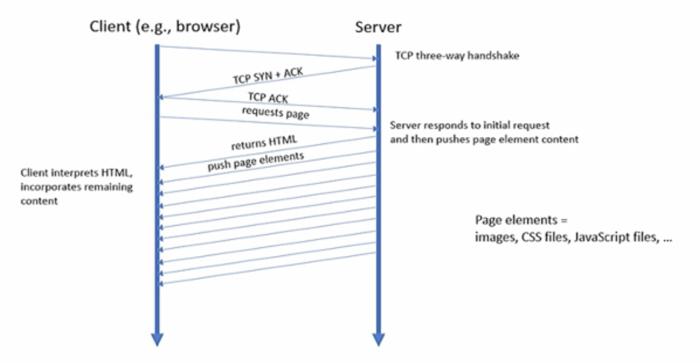

(19th Oct)

# Why QUIC and HTTP/2 / HTTP/3?
Conventional HTTP over TCP has its shortcomings
- Slow window growth / congestion control overreaction in TCP:
    - In successive TCP congestions, every connection is treated as new: new attempt to match `cwnd`, but in most successive connections over the same path, the ideal `cwnd` value is in the same ballpark.
        - HTTP keep-alive addresses this by re-using same connection for multiple requests, but this doesn't work for parallel connections.
    - Head-of-line blocking: If a TCP connection slows down for one HTTP response or data for a response is slow to arrive at the server, all subsequent responses on the connection are also delayed.
- Website conventionally load recursively - client requests, interprets response, and then requests additional content. 
    - This adds additional request/response RTT's to page load.


Oh and if you want encryption? 3xRTT's.


# HTTP/2
Two major advances over HTTP/1.1:
1. Server can **push** content: E.g., server knows which additional elements a page needs & can send them unrequested (=no need for client to request).
2. Multiplexing: (push) content can be spread over multiple parallel streams.
    - A _stream_ is a bi-directional sequence of frames exchanged within an HTTP/2 connection. Frames from different streams can be mixed in a single connection - no head of line blocking if a separate stream is delayed.



The method of this is described in an RFC:
- IF TLS is used: use string in `ALPN` (application layer protocol negotiation)
- If plain text TCP is used

```
Connection: Upgrade, HTTP2-Settings
Upgrade: h2c
HTTP2-Settings: .........
```

The two new headers there are additional, and ignored for HTTP/1.1 only servers.

## HTTP/2 Response
- If HTTP/2 isn't supported by the server
    - Content-Length leading the way, etc... etc...

- IF HTTP/2 is supported:
    ```
    HTTP/1.1 101 Switching Protocols
    Connection: Upgrade
    Upgrade: h2c
    
    [ HTTP/2 connection ...
    ```

Note HTTP/2 connections are _frame_-based - each frame belongs to a stream. (Think about a frame as a packet in a TCP connection, instead of sending bytes, send them in a frame like format, each frame belongs to a stream)

### HTTP/2 Frames
9 bytes ("octets") of frame header:
- 24 bit length field
- 8 bit type field. Currently, 10 different types are defined.
    - `DATA`, `HEADERS`, `SETTINGS`, `PUSH_PROMISE`, `WINDOW_UPDATE`, ...
- 8 bit flag field
- 1 bit reserved / unused
- 31 bits of stream identifier

Followed by at least up to 2^14 octets (16384 bytes) of frame content. May be up to 2^24-1 octets.

#### HTTP/2 Stream
1. `PUSH_PROMISE` frame: sets stream ID
2. `HEADER` frame: compressed HTTP headers
    1. `CONTINUATION` frame(s) can be sent immediately after a `HEADER` frame with more header fragments
3. `DATA` frame: request or response data (always response data in case of push).

May also contain other types of frames.

## HTTP/2 doesn't fix encryption


# HTTP/3
Essentially HTTP/2 over QUIC


# QUIC
QUIC UDP Internet Connections.
- Transport layer protocol, yes, but runs over UDP (transport layer over transport layer)
    - Not part of the standard TCP/IP stack, but usually added via an application layer library (read: application developers need to deal with it).
- Uses UDP packets from stream frames
    - Flow & congestion control on a per-stream basis - no head-of-line blocking.

Loss detection and congestion controls is in `RFC9002`
- Similar to TCP in many ways, but:
    - Packet numbers are per stream.
    - Packer numbers are ACKed, not byte numbers. Packer numbers also increase sequentially, position in byte stream isn't related to packet number (there's an offset field in the stream frame header for that).
    - QUIC ACKs are really SACKs, and more flexible, too.
    - Minimum congestion window is 2 packets not 1.

#### QUIC is UDP, so...
- It doesn't work when UDP is blocked (e.g., on some satellite links)
- It isn't necessarily friendly to TCP connections running in parallel.

## QUIC, HTTP, and encryption
- QUIC encryption is quick:
    - Client sends its public key with first packet
    - Server can return certificate with its public key and a shared key (encrypted with client public key) in response
    - All done in only 1RTT - not 3 RTT as before
    - Why is there no need to negotiate a cipher as in the classic HTTPS handshake?
        - Is there a way to make it even quicker?

- Initial HTTP request can go into first packet from client. (Provided the client is happy the first request goes in plain text).
